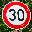
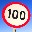
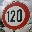
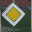
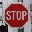
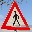
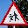

# **Traffic Sign Recognition** 

---

**Build a Traffic Sign Recognition Project**

The goals / steps of this project are the following:
* Load the data set (see below for links to the project data set)
* Explore, summarize and visualize the data set
* Design, train and test a model architecture
* Use the model to make predictions on new images
* Analyze the softmax probabilities of the new images
* Summarize the results with a written report

[//]: # (Image References)

[image1]: ./examples/visualization.jpg "Visualization"
[image2]: ./examples/grayscale.jpg "Grayscaling"
[image3]: ./examples/random_noise.jpg "Random Noise"
[histodata]: ./figs/histogram.png
[histonewdata]: ./figs/histogram_new_data.png
[softmax]: ./figs/softmax.png

---
### Data Set Summary & Exploration

#### 1. Provide a basic summary of the data set. In the code, the analysis should be done using python, numpy and/or pandas methods rather than hardcoding results manually.

Using the provided, pre-partitioned training, validation, and test sets, a summary of the data set is listed below:

* The size of training set is 34799. 
* The size of the validation set is 4410.
* The size of test set is 12630.
* The shape of a traffic sign image is 32x32.
* The number of unique classes/labels in the data set is 43.

#### 2. Include an exploratory visualization of the dataset.

Below is a histogram for the training, validation, and training sets.

![alt text][histodata]

### Design and Test a Model Architecture

#### 1. Describe how you preprocessed the image data. What techniques were chosen and why did you choose these techniques? Consider including images showing the output of each preprocessing technique. Pre-processing refers to techniques such as converting to grayscale, normalization, etc. (OPTIONAL: As described in the "Stand Out Suggestions" part of the rubric, if you generated additional data for training, describe why you decided to generate additional data, how you generated the data, and provide example images of the additional data. Then describe the characteristics of the augmented training set like number of images in the set, number of images for each class, etc.)

* Training set augmentation
* Used Rotation and random images from label
* Normalize
* Grayscale vs no Grayscale

The provided data set has a fairly uneven distribution of training samples with an entire order of magnitude difference between the classes with the smallest and largest sample sizes. This differential can cause the neural network to skew towards a particular set of classes and under-represent the classes with lower sample sizes. Since one cannot simply produce more data without going through the collection process, one method to alleviate this issue is to modify the data set by adding images with realistic augmentations. For my method to add samples to classes with lower sample counts, I chose a random image from the original set of images and rotated the image with a random angle (Gaussian distribution, mu = 0,std = 5). These images were added until the class's sample size met a defined threshold of 1500.  Ideally, more image augmentations could be used, such as changing the contrast, shifting the image, Affine transforms. Since I'm only using a single augmentation technique, the risk of overfitting to the classes with augmented images is high since it could be over-represented.

After the data set augmentation, the training set augmentation histogram had a more even distribution:

![alt_text][histonewdata]

Only the training set had its data set augmented because augmenting the validation and training set would train the neural network match falsified data and will devalue the provided real world data. 

Since the images are imported as RGB unsigned 8-bit integers, the values needed to be normalized to values between -1 and 1. I used the formula, x = (x - 127.5)/128.0 to normalize the pixel data. Grayscaling was another preprocessing option, but I found that feeding the RGB data into the CNN could created better decision making for signs with color such as the traffic sign. 

#### 2. Describe what your final model architecture looks like including model type, layers, layer sizes, connectivity, etc.) Consider including a diagram and/or table describing the final model.

My final model consisted of the following layers:

| Layer         		|     Description	        					| 
|:---------------------:|:---------------------------------------------:| 
| Input         		| 32x32x3 RGB image   							| 
| Convolution #1 5x5   	| 1x1 stride, valid padding, outputs 28x28x6 	|
| RELU					|												|
| Max pooling	      	| 2x2 stride,  outputs 14x14x6   				|
| Convolution #2 5x5    | 1x1 stride, valid padding, outputs 10x10x16	|
| RELU					|												|
| Max pooling	      	| 2x2 stride,  outputs 5x5x16   				|
| Convolution #3 3x3    | 2x2 stride, valid padding, outputs 2x2x100	|
| RELU					|												|
| Flatten				| 2x2x100 -> 400								|
| Fully connected #1	| 400 -> 120             						|
| RELU					|												|
| Dropout               | Keep prob = 0.5                               |
| Fully connected #2	| 120 -> 84             						|
| RELU					|												|
| Dropout               | Keep prob = 0.5                               |
| Fully connected #3	| 84 -> 43                 						|

#### 3. Describe how you trained your model. The discussion can include the type of optimizer, the batch size, number of epochs and any hyperparameters such as learning rate.

To train the model, I used an Adam optimizer that minimizes the loss function. The loss function was a summation of the mean of the softmax and the l2 regularization loss scaled by the beta hyper parameter. 

The following hyper parameters were used:

* EPOCHS = 25
* BATCH_SIZE = 150
* learning_rate = 0.001
* beta = 0.00095 (L2 regularization)
* mu = 0, sigma = 0.1 (for random weights)

#### 4. Describe the approach taken for finding a solution and getting the validation set accuracy to be at least 0.93. Include in the discussion the results on the training, validation and test sets and where in the code these were calculated. Your approach may have been an iterative process, in which case, outline the steps you took to get to the final solution and why you chose those steps. Perhaps your solution involved an already well known implementation or architecture. In this case, discuss why you think the architecture is suitable for the current problem.

My final model results were:
* validation set accuracy of 0.960 
* test set accuracy of 0.940

If an iterative approach was chosen:
* What was the first architecture that was tried and why was it chosen?
    * The LeNet architecture that was taught in the CNN lessons was used since architecture originally provided yielded a result of 0.89 providing a good starting point.  
* What were some problems with the initial architecture?
    * The biggest issue with the initial architecture was the training set distribution. Some of the classes had less than 200 images, which was definitely not enough to train with. 
* How was the architecture adjusted and why was it adjusted? 
    * Another convolutional layer, dropout, and L2 Regularization were added to the original LeNet architecture. Adding a 3rd convolutional layer improved training so that the CNN could recognize smaller details. Adding the dropout for the fully connected layers noticably prevented overfitting when I was testing the CNN with large EPOCH values. The L2 regularization provided a very marginal benefit to the validation and test results. 
* Which parameters were tuned? How were they adjusted and why?
    * The parameters that had the largest impact were the number of epocs, learning rate, and dropout keep probability. The number of EPOCHS and learning rate had an inverse relationship. If the learning rate was decreased, the number of EPOCHs needed to be increased to account for the slower learning. I chose the learning rate of 0.001 and EPOCHS = 25 because I found very marginal improvements with slower learning rates. The dropout probability of 0.5 seemed appropriate since a large portion of the training data set was augmented, which meant that there were a lot of repetitive images with only the rotation augmentation. If I had used more image augmentation techniques, I could have reduced the risk of overfitting the neural network. 
* What are some of the important design choices and why were they chosen? 
    * A convolutional neural network works well with this problem because of the 2d nature of images. A CNN can break the images down into smaller regions and recognize patterns at each detail level. The user can define the CNN based on the size of "features" in the images. For example, there could be a layer that looks for text based on character width or another layer that evaluates the shape of the whole sign.  

### Test a Model on New Images

#### 1. Choose five German traffic signs found on the web and provide them in the report. For each image, discuss what quality or qualities might be difficult to classify.

I ended up choosing nine different German Traffic signs. 

1. 30 - This image could be difficult to classify because of the shrubbery in the background, which looks like noise, which the CNN might not have been properly trained for. 
2. 100 - This image has a slight tilt, and might also be confused with the 120 kph sign.
3. 120 - This image was rotated in a way that doesn't fit the same rotation used in the data set augmentation. It also might be mis-classified as 100 or 20 kph.
4. No passing - The red car is missing it's roof from the down sampling of the image. 
5. Priority Road - This sign actually is the most unique of all the classes, but is shifted to the top left corner. 
6. Stop - This stop sign is another relatively unique sign, but could classified as another speed sign.
7. Pedestrians - This sign is difficult to differentiate from other red-white trianble signs.
8. Children Crossing - This sign has the same issue as the Pedestrians sign. 
9. Roundabout - This sign could be classified as one of the other seven blue signs with white arrows. 

#### 2. Discuss the model's predictions on these new traffic signs and compare the results to predicting on the test set. At a minimum, discuss what the predictions were, the accuracy on these new predictions, and compare the accuracy to the accuracy on the test set (OPTIONAL: Discuss the results in more detail as described in the "Stand Out Suggestions" part of the rubric).

Here are the results of the prediction:

| Image			        |     Prediction	        					| 
|:---------------------:|:---------------------------------------------:| 
| 30 KPH      		    | 30 KPH   					    				| 
| 100 KPH     			| 100 KPH                   					|
| 120 KPH				| 20 KPH										|
| No Passing	      	| No Passing					 				|
| Priority Rd			| Priority Rd      							    |
| Stop 			        | Stop      							        |
| Pedestrians			| Pedestrians      							    |
| Children Crossing		| Children Crossing                   		    |
| Roundabout			| Roundabout    						    	|

The model was able to correctly guess 8 of the 9 traffic signs, which gives an accuracy of 88.9%. This compares favorably to the accuracy on the test set of 93.5%. However, the performance of the model's prediction could heavily rely on the selection of signs. The current model can sometimes be inconsistent with the results on the new test images due to the randomness of the weights and data set augmentation. 

The only misclassified sign was the 120 KPH sign, which was understandably mis-classified as the 20 kph sign. 

#### 3. Describe how certain the model is when predicting on each of the five new images by looking at the softmax probabilities for each prediction. Provide the top 5 softmax probabilities for each image along with the sign type of each probability. 

The code for making predictions on my final model is located in the 16th and 18th cell of the Ipython notebook.

![alt text][softmax]

The model had anywhere between 80% to 100% certainty for the correctly classified signs. For the misclassified 120 KPH sign, it was very certain that it was a 20 KPH sign and had a 0.4% certainty that it was a 120 KPH sign. It's possible that the rotation of the sign skewed the 120 text to make the 20 part larger and more prominent. 

